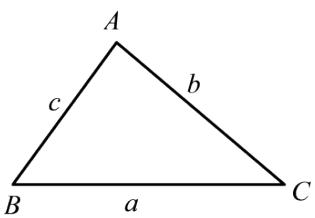
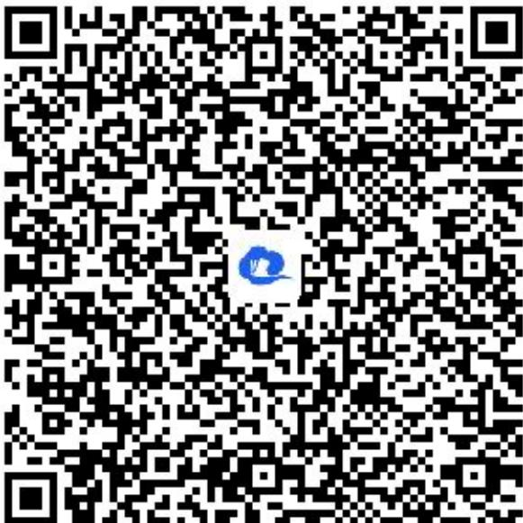

> [!faq]- 《7.3.2复数乘、除运算的三角表示及几何意义》答案与解析
>
> > [!success]- **【答案】** 详见解析
>
> > [!note]- **【解析】**
> > 证明： $a^{2}=b^{2}+c^{2}-2bccosA$ .
> >
> > 
> >
> > 【正确答案】请查看本题解析视频
> >
> > 【更多习题信息】
> >
> > 难易度：偏难
> >
> > 知识点：复数乘、除运算的三角表示及其几何意义
> >
> > 【智慧中小学APP扫码查看完整解析】
> >
> > 
