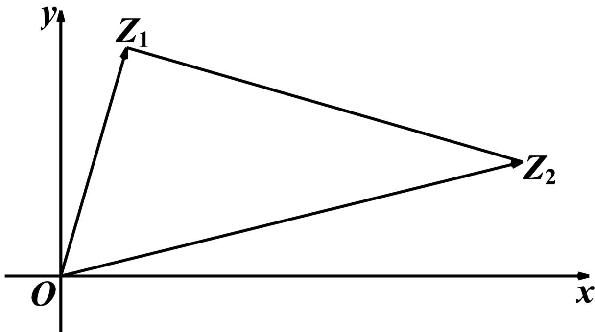

<!-- question-source:start -->
3.【复合题】如图所示，若 $\overrightarrow{OZ_{1}}$ 和 $\overrightarrow{OZ_{2}}$ 分别表示复数 $z_{1}=1+2\sqrt{3}i,\quad z_{2}=7+\sqrt{3}i.$

(1)【问答题】求 $\angle Z_{1}OZ_{2}$ ;

(2)【问答题】判断 $\Delta Z_{1}OZ_{2}$ 的形状.
<!-- question-source:end -->

![[高中/课堂同步/智慧中小学/必修第二册/第七章 复数/7.3 复数的三角表示/7_3复数的三角表示习题课/三_复合题/习题/answers/Q00052287A1.md]]
