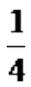

<!-- question-source:start -->
3.【填空题】某校有高一学生105人，高二学生126人，高三学生42人，现用按比例分配的分层随机抽样方法从中抽取13人进行关于作息时间的问卷调查，设问题的选择分为“同意”和“不同意”两种，且每人都做了一种选择，下面表格中提供了被调查人答题情况的总分信息，估计所有学生中“同意”的有\_\_\_\_人。

<table><tr><td></td><td>同意</td><td>不同意</td><td>合计</td></tr><tr><td>高一年级</td><td></td><td>2</td><td></td></tr><tr><td>高二年级</td><td></td><td>4</td><td></td></tr></table>

<table><tr><td>高三年级</td><td>1</td><td></td><td></td></tr></table>
<!-- question-source:end -->

![[高中/课堂同步/智慧中小学/必修第二册/第九章 统计/9.1.2 分层随机抽样/9_1_2分层随机抽样/二_填空题/习题/answers/Q00052302A1.md]]
