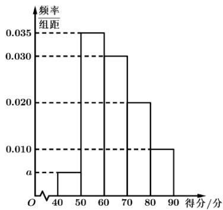

<!-- question-source:start -->
1.【多选题】在一次测验中共有500名同学参赛，经过评判，这500名考生的得分都在[40,90]之间，其得分的频率分布直方图如图，则下列结论正确的是（）

A. 可求得 $a = 0.005$ B. 得分在 $[50,60)$ 的同学最多  
C. 得分在 $[60,80)$ 之间的频率为0.5  
D. 得分在 $[40,60)$ 之间的共有200人
<!-- question-source:end -->

![[高中/课堂同步/智慧中小学/必修第二册/第九章 统计/9.2.1 总体取值规律的估计/9_2_1总体取值规律的估计_1_/一_多选题/习题/answers/Q00052317A1.md]]
