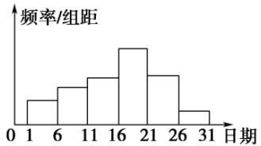

<!-- question-source:start -->
4.【复合题】在学校开展的综合实践活动中，某班进行了小制作评比，作品上交时间为5月1日至30日，评委会把同学们上交作品的件数按5天一组分组统计，绘制了频率分布直方图(如图所示).已知从左到右各长方形的高的比为 $2:3:4:6:4:1$ ，第三组的频数为12，请解答下列问题：

(1)【问答题】本次活动共有多少件作品参加评比？

(2)【问答题】哪组上交的作品数最多？有多少件？

(3)【问答题】经过评比，第四组和第六组分别有10件、2件作品获奖，问这两组哪组获奖率较高？
<!-- question-source:end -->

![[高中/课堂同步/智慧中小学/必修第二册/第九章 统计/9.2.1 总体取值规律的估计/9_2_1总体取值规律的估计_1_/三_复合题/习题/answers/Q00052320A1.md]]
