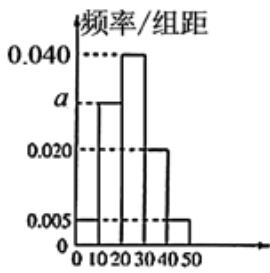
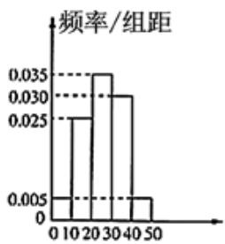

<!-- question-source:start -->
2.【填空题】某中学有初中学生1800人，高中学生1200人.为了解学生本学期课外阅读情况，现采用分层随机抽样的方法，从中抽取了100名学生，先统计了他们的课外阅读时间，然后按初中学生和高中学生分为两组，再将每组学生的阅读时间（单位：h）分为5组：[1,10)，[10,20)，[20,30)，[30,40)，[40,50)

，并分别加以统计，得到如图所示的频率分布直方图，试估计该校所有学生中，阅读时间不小于30h的学生人数为\_\_\_\_。

  
初中学生组

  
高中学生组
<!-- question-source:end -->

![[高中/课堂同步/智慧中小学/必修第二册/第九章 统计/9.2.1 总体取值规律的估计/9_2_1总体取值规律的估计_1_/二_填空题/习题/answers/Q00052318A1.md]]
