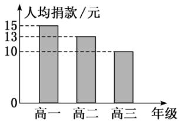

<!-- question-source:start -->
3.【填空题】如图是根据某中学为地震灾区捐款的情况而制作的统计图。已知该校在校学生3000人，根据统计图计算该校共捐款\_\_\_\_元。

<!-- question-source:end -->

![[高中/课堂同步/智慧中小学/必修第二册/第九章 统计/9.2.1 总体取值规律的估计/9_2_1总体取值规律的估计_1_/二_填空题/习题/answers/Q00052319A1.md]]
