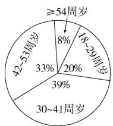
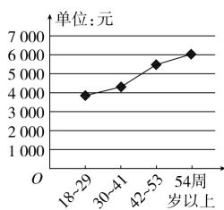
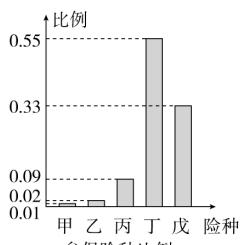

<!-- question-source:start -->
1. 【单选题】某保险公司为客户定制了5个险种：甲，一年期短险；乙，两全保险；丙，理财类保险；丁，定期寿险；戊，重大疾病保险，各种保险按相关约定进行参保与理赔。该保险公司对5个险种参保客户进行抽样调查，得出如下的统计图例，以下四个选项错误的是（）

参保险种比例  

  
参保人数比例  
不同年龄段人均参保费用

A. 54周岁以上参保人数最少  
B. 丁险种更受参保人青睐  
C. 30周岁以上的人群约占参保人群的 $80\%$ D. $18 \sim 29$ 周岁人群参保总费用最少

D. 18～29周岁人群参保总费用最少
<!-- question-source:end -->

![[高中/课堂同步/智慧中小学/必修第二册/第九章 统计/9.2.1 总体取值规律的估计/9_2_1总体取值规律的估计_2_/一_单选题/习题/answers/Q00052322A1.md]]
