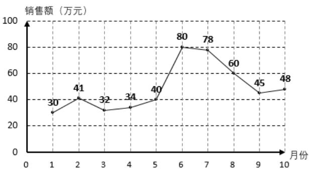

<!-- question-source:start -->
2.【单选题】如图是某公司2021年1月到10月的销售额(单位：万元)的折线图，销售额在35万元以下为亏损，超过35万元为盈利，则下列说法错误的是（）

A. 这10个月中销售额最低的是1月份  
B. 从1月到6月销售额逐渐增加  
C. 这10个月中有3个月是亏损的  
D. 这10个月销售额的中位数是43万元
<!-- question-source:end -->

![[高中/课堂同步/智慧中小学/必修第二册/第九章 统计/9.2.1 总体取值规律的估计/9_2_1总体取值规律的估计_2_/一_单选题/习题/answers/Q00052323A1.md]]
