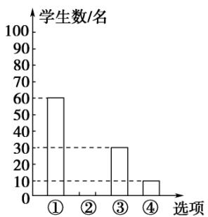
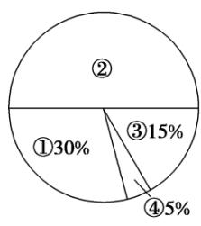

<!-- question-source:start -->
4.【复合题】为了了解学生参加体育活动的情况，学校对学生进行随机抽样调查，其中一个问题是“你平均每天参加体育活动的时间是多少？”，共有4个选项：①1.5小时以上；②1～1.5小时；③0.5～1小时；④0.5小时以下．下图是根据调查结果绘制的两幅不完整的统计图，请你根据统计图提供的信息解答以下问题：

  
图
(1)

  
图
(2)

(1)【问答题】本次一共调查了多少名学生？

(2)【问答题】在图
(1)中将②对应的部分补充完整;

(3)【问答题】若该校有3000名学生，试估计全校学生平均每天参加体育活动的时间在0.5小时以下的人数.
<!-- question-source:end -->

![[高中/课堂同步/智慧中小学/必修第二册/第九章 统计/9.2.1 总体取值规律的估计/9_2_1总体取值规律的估计_2_/三_复合题/习题/answers/Q00052325A1.md]]
