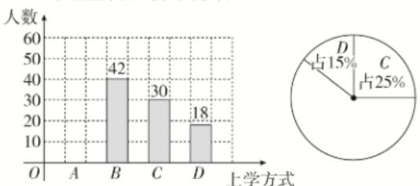

<!-- question-source:start -->
3.【填空题】某学校为了了解本校学生的上学方式,在全校范围内随机抽查部分学生,了解到上学方式主要有:A—结伴步行,B—自行乘车,C—家人接送,D—其他方式.并将收集的数据整理绘制成如下两幅不完整的统计图.根据图中信息,本次抽查的学生中A类人数是\_\_\_\_.

学生上学方式条形统计图 学生上学方式扇形统计图

<!-- question-source:end -->

![[高中/课堂同步/智慧中小学/必修第二册/第九章 统计/9.2.1 总体取值规律的估计/9_2_1总体取值规律的估计_2_/二_填空题/习题/answers/Q00052324A1.md]]
