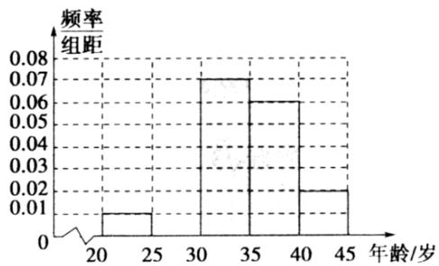

<!-- question-source:start -->
4.【复合题】对某市“四城同创”活动中800名志愿者的年龄抽样调查统计后得到频率分布直方图（如图），但是年龄组为[25,30)的数据不慎丢失，则依据此图可得：

(1)【填空题】年龄组为[25,30)对应小矩形的高度为\_\_\_\_；

(2)【填空题】由频率分布直方图估计志愿者年龄的85%分位数为\_\_\_\_岁（结果保留整数）。
<!-- question-source:end -->

![[高中/课堂同步/智慧中小学/必修第二册/第九章 统计/9.2.2 总体百分位数的估计/9_2_2总体百分位数的估计/三_复合题/习题/answers/Q00052316A1.md]]
