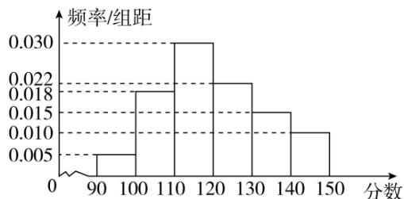

<!-- question-source:start -->
3.【填空题】某校100名学生的数学测试成绩频率分布直方图如图所示，分数不低于a(a为整数)即为优秀，如果优秀的人数为20人，则a的估计值是\_\_\_\_。

<!-- question-source:end -->

![[高中/课堂同步/智慧中小学/必修第二册/第九章 统计/9.2.2 总体百分位数的估计/9_2_2总体百分位数的估计/二_填空题/习题/answers/Q00052315A1.md]]
