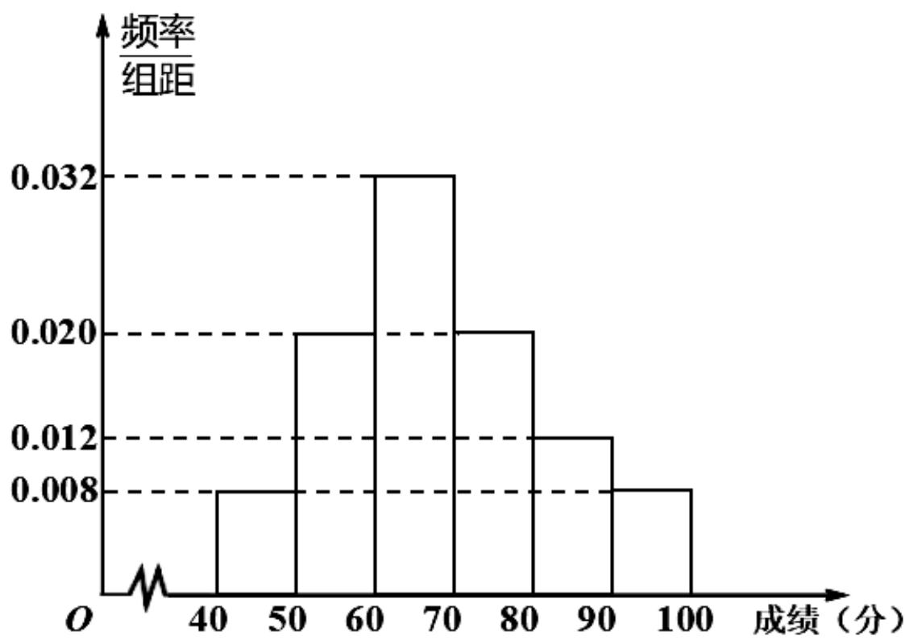

<!-- question-source:start -->
2.【填空题】某校为了解学生体能素质，随机抽取了50名学生，进行体能测试，并将这50名学生成绩整理得如下频率分布直方图，根据此频率分布直方图，

  
有下列5个结论：

（1）这50名学生中成绩在[80, 100]内的人数占比为 $20\%$

（2）这50名学生中成绩在[60,80)内的人数有26人；

（3）这50名学生成绩的中位数为70；

（4）这50名学生成绩的众数为65；

(5) 这50名学生的平均成绩 $\bar{x} = 68.2$ (同一组中的数据用该组区间的中点值做代表)。其中正确的序号是\_\_\_\_。
<!-- question-source:end -->

![[高中/课堂同步/智慧中小学/必修第二册/第九章 统计/9.2.3 总体集中趋势的估计/9_2_3总体集中趋势的估计/二_填空题/习题/answers/Q00052311A1.md]]
