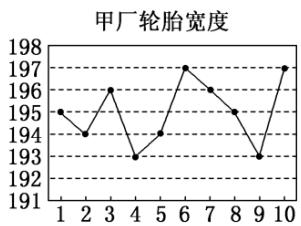

<!-- question-source:start -->
5.【复合题】为了了解甲、乙两个工厂生产的轮胎的宽度是否达标，从两厂各随机选取了10个轮胎，将每个轮胎的宽度(单位：mm)记录下来并绘制出如下的折线图：

(1)【问答题】分别计算甲、乙两厂提供的10个轮胎宽度的平均值;

(2)【问答题】若轮胎的宽度在[194, 196]内，则称这个轮胎是标准轮胎。试比较甲、乙两厂分别提供的10个轮胎中所有标准轮胎宽度的方差的大小，根据两厂的标准轮胎宽度的平均水平及其波动情况，判断这两个工厂哪个的轮胎相对更好。
<!-- question-source:end -->

![[高中/课堂同步/智慧中小学/必修第二册/第九章 统计/9.2.4 总体离散程度的估计/9_2_4总体离散程度的估计/三_复合题/习题/answers/Q00052309A1.md]]
