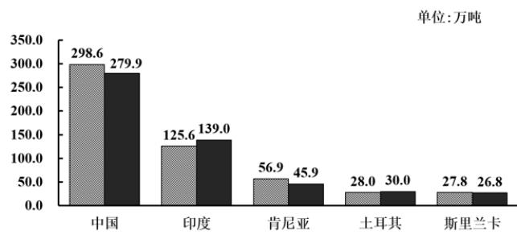

<!-- question-source:start -->
1.【单选题】茶叶源于中国，至今中国仍然是茶叶最大生产国，下图为2019-2020年全球主要茶叶生产国调查数据，根据该图，下列结论中不正确的是（）2019-2020年全球主要茶叶生产国产量分布。

A. 2019年图中5个国家茶叶产量的中位数为45.9  
B. 2020年图中5个国家茶叶产量比2019年增幅最大的是中国  
C. 2020年图中5个国家茶叶总产量超过2019年  
D. 2020年中国茶叶产量超过其他4个国家之和
<!-- question-source:end -->

![[高中/课堂同步/智慧中小学/必修第二册/第九章 统计/9.3 统计案例 公司员工的肥胖情况调查分析/9_3统计案例_公司员工肥胖情况调查分析/一_单选题/习题/answers/Q00052326A1.md]]
