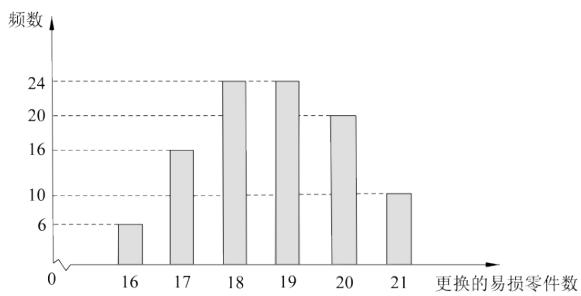

<!-- question-source:start -->
2.【复合题】某公司计划购买1台机器，该种机器使用三年后即被淘汰。机器有一易损零件，在购进机器时，可以额外购买这种零件作为备件，每个200元．在机器使用期间，如果备件不足再购买，则每个500元．现需决策在购买机器时应同时购买几个易损零件，为此搜集并整理了1100台这种机器在三年使用期内更换的易损零件数，得下面柱状图：

记x表示1台机器在三年使用期内需更换的易损零件数，y表示1台机器在购买易损零件上所需的费用（单位：元），n表示购机的同时购买的易损零件数。

(1)【问答题】若n=19，求y与x的函数解析式；

(2)【问答题】假设这100台机器在购机的同时每台都购买18个易损零件，或每台都购买19个易损零件，分别计算这100台机器在购买易损零件上所需费用的平均数，以此作为决策依据，购买1台机器的同时应购买18个还是19个易损零件？
<!-- question-source:end -->

![[高中/课堂同步/智慧中小学/必修第二册/第九章 统计/9.3 统计案例 公司员工的肥胖情况调查分析/9_3统计案例_公司员工肥胖情况调查分析/二_复合题/习题/answers/Q00052327A1.md]]
