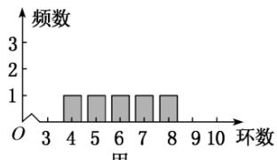
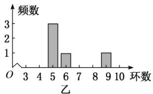

<!-- question-source:start -->
2.【单选题】甲、乙两人在一次射击比赛中各射靶5次，两人成绩的条形计图如图所示，则( )

  
甲

A.甲的成绩的平均数小于乙的成绩的平均数  
B.甲的成绩的中位数等于乙的成绩的中位数  
C.甲的成绩的方差小于乙的成绩的方差  
D.甲的成绩的极差小于乙的成绩的极差
<!-- question-source:end -->

![[高中/课堂同步/智慧中小学/必修第二册/第九章 统计/小结/小结_2_/一_单选题/习题/answers/Q00052349A1.md]]
