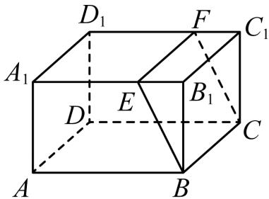

<!-- question-source:start -->
2.【复合题】如图为长方体 $ABCD - A_{1}B_{1}C_{1}D_{1}$

(1)【问答题】这个长方体是棱柱吗？如果是，是几棱柱？为什么？

(2)【问答题】用平面BCFE

把这个长方体分成两部分后，各部分形成的几何体还是棱柱吗？如果是，是几棱柱？如果不是，请说明理由。
<!-- question-source:end -->

![[高中/课堂同步/智慧中小学/必修第二册/第八章 立体几何初步/8.1 基本立体图形/8_1基本立体图形_1_/一_复合题/习题/answers/Q00052335A1.md]]
