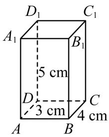

<!-- question-source:start -->
3.【问答题】如图，长方体的长、宽、高分别为 $4 \mathrm{~cm}, 3 \mathrm{~cm}, 5 \mathrm{~cm}$ ，一只蚂蚁从点 $A$ 到点 $C_{1}$ 沿着表面爬行的最短距离是多少？

<!-- question-source:end -->

![[高中/课堂同步/智慧中小学/必修第二册/第八章 立体几何初步/8.1 基本立体图形/8_1基本立体图形_1_/二_问答题/习题/answers/Q00052336A1.md]]
