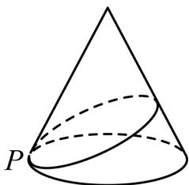

<!-- question-source:start -->
1.【填空题】如图，一立在水平地面上的圆锥形物体的母线长为4 m，一只小虫从圆锥的底面圆上的点P出发，绕圆锥表面爬行一周后回到点P处．若该小虫爬行的最短路程为 $4\sqrt{2}m$ ，则圆锥底面圆的半径等于\_\_\_\_m。

<!-- question-source:end -->

![[高中/课堂同步/智慧中小学/必修第二册/第八章 立体几何初步/8.1 基本立体图形/8_1基本立体图形_2_/一_填空题/习题/answers/Q00052345A1.md]]
