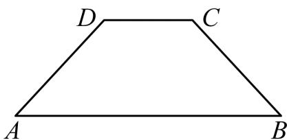

<!-- question-source:start -->
3.【问答题】如图，将等腰梯形ABCD绕边AB所在的直线旋转一周，由此形成的几何体是由哪些简单几何体构成的？

<!-- question-source:end -->

![[高中/课堂同步/智慧中小学/必修第二册/第八章 立体几何初步/8.1 基本立体图形/8_1基本立体图形_2_/三_问答题/习题/answers/Q00052347A1.md]]
