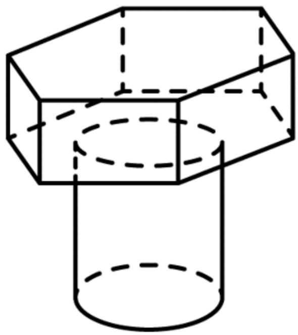
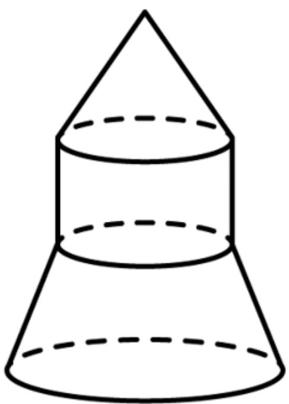

<!-- question-source:start -->
2.【复合题】以下组合体分别是由哪些简单几何体构成的？

  
(1)【问答题】

(2)【问答题】
<!-- question-source:end -->

![[高中/课堂同步/智慧中小学/必修第二册/第八章 立体几何初步/8.1 基本立体图形/8_1基本立体图形_2_/二_复合题/习题/answers/Q00052346A1.md]]
