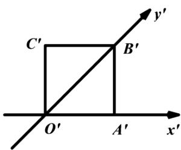

<!-- question-source:start -->
1.【单选题】如图所示，正方形 $O'A'B'C'$ 的边长为1cm

，它是用斜二测画法得到的一个水平放置的平面图形的直观图，则原图形的周长是（）

A. 4cm

B. 8cm

C. $(2+3\sqrt{2})cm$

D. $(2 + 2\sqrt{3})cm$
<!-- question-source:end -->

![[高中/课堂同步/智慧中小学/必修第二册/第八章 立体几何初步/8.2 立体图形的直观图/8_2立体图形的直观图/一_单选题/习题/answers/Q00052337A1.md]]
