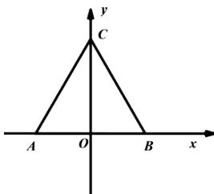

<!-- question-source:start -->
4.【填空题】如图所示, $\triangle ABC$ 是边长为 1 的等边三角形, 那么 $\triangle ABC$ 的斜二测画法直观图 $\triangle A'B'C'$ 的面积是\_\_\_\_。

<!-- question-source:end -->

![[高中/课堂同步/智慧中小学/必修第二册/第八章 立体几何初步/8.2 立体图形的直观图/8_2立体图形的直观图/二_填空题/习题/answers/Q00052340A1.md]]
