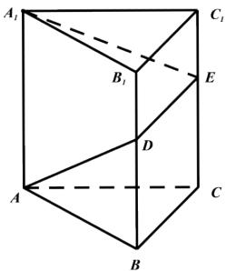

<!-- question-source:start -->
5.【填空题】如图所示，在所有棱长均为l的直三棱柱 $ABC-A_{1}B_{1}C_{1}$ 上，有一只蚂蚁从点A出发，围着三棱柱的侧面爬行一周到达点 $A_{1}$ ，则爬行的最短路程为\_\_\_\_。

<!-- question-source:end -->

![[高中/课堂同步/智慧中小学/必修第二册/第八章 立体几何初步/8.2 立体图形的直观图/8_2立体图形的直观图/二_填空题/习题/answers/Q00052341A1.md]]
