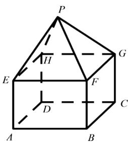

<!-- question-source:start -->
2.【单选题】某组合体如图所示，上半部分是正四棱锥P-EFGH，下半部分是长方体ABCD-EFGH.正四棱锥P-EFGH的高为 $\sqrt{3}$ ，EF=2,AE=1.则该组合体的表面积为（）

A. 20

$$
4 \sqrt {3} + 1 2
$$

C. 16

$$
4 \sqrt {3} + 8
$$

难易度：适中

知识点：组合体的表面积

【智慧中小学APP扫码查看完整解析】

<!-- question-source:end -->
