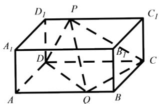

<!-- question-source:start -->
5.【问答题】如图所示, 已知长方体 $ABCD - A_{1}B_{1}C_{1}D_{1}$ 的体积为 $V$ , $P$ 是棱 $D_{1}C_{1}$ 上的动点, $Q$ 是棱 $AB$ 上的动点, 求三棱锥 $P - CDQ$ 的体积。

<!-- question-source:end -->

![[高中/课堂同步/智慧中小学/必修第二册/第八章 立体几何初步/8.3.1 棱柱、棱锥、棱台的表面积和体积/8_3_1棱柱_棱锥_棱台的表面积和体积/三_问答题/习题/answers/Q00052333A1.md]]
