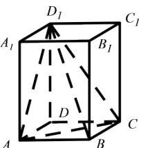

<!-- question-source:start -->
4.【填空题】如图，直四棱柱 $ABCD-A_{1}B_{1}C_{1}D_{1}$ 底面为菱形，且 $\angle BAD=60^{\circ}$ ，侧棱长为3,对角线 $BD_{1}=\sqrt{13}$ ，则三棱锥 $D_{1}-ACD$ 的表面积为\_\_\_\_。

<!-- question-source:end -->

![[高中/课堂同步/智慧中小学/必修第二册/第八章 立体几何初步/8.3.1 棱柱、棱锥、棱台的表面积和体积/8_3_1棱柱_棱锥_棱台的表面积和体积/二_填空题/习题/answers/Q00052332A1.md]]
