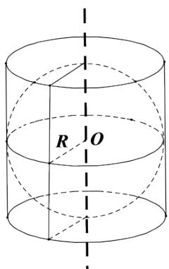

<!-- question-source:start -->
4.【复合题】如图所示是古希腊数学家阿基米德的墓碑文，墓碑上刻着一个圆柱，圆柱内有一个内切球，这个球的直径恰好与圆柱的高相等，相传这个图形表达了阿基米德最引以为自豪的发现.我们来研究这个具有对称美的几何体。

(1)【填空题】球的表面积与圆柱的表面积之比为\_\_\_\_。

(2)【填空题】球的体积与圆柱的体积之比为\_\_\_\_。

<!-- question-source:end -->

![[高中/课堂同步/智慧中小学/必修第二册/第八章 立体几何初步/8.3.2 圆柱、圆锥、圆台、球的表面积和体积/8_3_2圆柱_圆锥_圆台_球的表面积和体积/三_复合题/习题/answers/Q00052361A1.md]]
