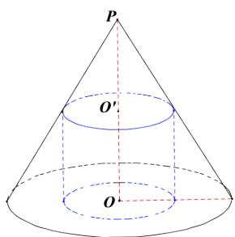

<!-- question-source:start -->
5.【问答题】如图，圆锥 $PO$ 的底面直径和高均是 $a$ ，过 $PO$ 的中点 $O'$

作平行于底面的截面，以该截面为底面挖去一个圆柱，求剩下几何体的体积。

<!-- question-source:end -->

![[高中/课堂同步/智慧中小学/必修第二册/第八章 立体几何初步/8.3.2 圆柱、圆锥、圆台、球的表面积和体积/8_3_2圆柱_圆锥_圆台_球的表面积和体积/三_复合题/习题/answers/Q00052362A1.md]]
