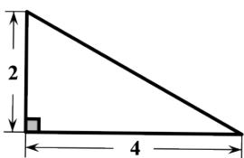
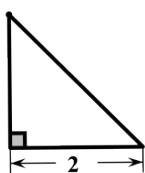
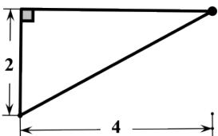

<!-- question-source:start -->
3.【填空题】某几何体的三视图如图所示，则该几何体的外接球的表面积为\_\_\_\_。

  
正视图

  
侧视图  
俯视图
<!-- question-source:end -->

![[高中/课堂同步/智慧中小学/必修第二册/第八章 立体几何初步/8.3.2 圆柱、圆锥、圆台、球的表面积和体积/8_3_2圆柱_圆锥_圆台_球的表面积和体积/二_填空题/习题/answers/Q00052360A1.md]]
