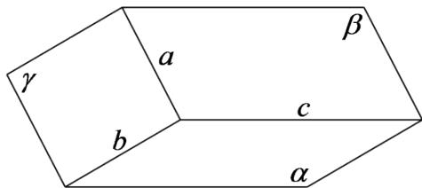

<!-- question-source:start -->
2.【问答题】已知三个平面 $\alpha,\beta,\gamma$ 满足： $\alpha\cap\beta=c,\quad\beta\cap\gamma=a,\quad\gamma\cap\alpha=b$ ，若直线a和b不平行，如图所示，求证：三条直线a,b,c过同一点。

<!-- question-source:end -->

![[高中/课堂同步/智慧中小学/必修第二册/第八章 立体几何初步/8.4.1 平面/8_4_1平面_1_/二_问答题/习题/answers/Q00052353A1.md]]
