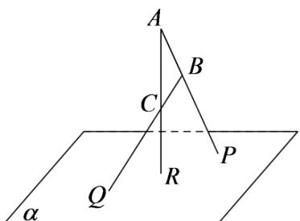

<!-- question-source:start -->
3.【问答题】如图， $\triangle ABC$ 在平面 $\alpha$ 外， $AB \cap \alpha = P, BC \cap \alpha = Q, AC \cap \alpha = R$ ，求证： $P, Q, R$ 三点共线。

<!-- question-source:end -->

![[高中/课堂同步/智慧中小学/必修第二册/第八章 立体几何初步/8.4.1 平面/8_4_1平面_1_/二_问答题/习题/answers/Q00052354A1.md]]
