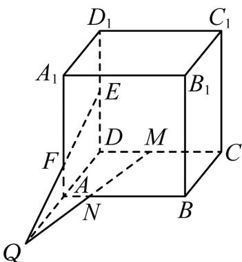

<!-- question-source:start -->
1. 【问答题】如图，在正方体 $ABCD-A_{I}B_{I}C_{I}D_{I}$ 中，M, N, E, F分别是棱CD, AB, $D_{D_{I}}$ , A, $A_{I}$ 上的点。若直线MN与EF交于点Q，求证：D, A, Q三点共线。

<!-- question-source:end -->

![[高中/课堂同步/智慧中小学/必修第二册/第八章 立体几何初步/8.4.1 平面/8_4_1平面_2_/一_问答题/习题/answers/Q00052355A1.md]]
