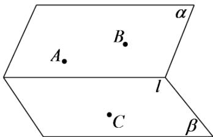

<!-- question-source:start -->
5.【问答题】如图，已知平面 $\alpha$ 和 $\beta$ 相交于直线 $l$ ，点 $A \in \alpha$ ，点 $B \in \alpha$ ，点 $C \in \beta$ ，且 $A \notin l, B \notin l$ ， $C \notin l$ 直线 $AB$ 与 $l$ 不平行，那么平面 $ABC$ 与平面 $\beta$ 的交线和直线 $l$ 有什么关系？证明你的结论。

<!-- question-source:end -->

![[高中/课堂同步/智慧中小学/必修第二册/第八章 立体几何初步/8.4.2 空间点、直线、平面之间的位置关系/8_4_2空间点_直线_平面之间的位置关系/三_复合题/习题/answers/Q00052374A1.md]]
