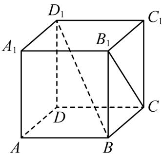

<!-- question-source:start -->
6.【问答题】如图，在正方体 $ABCD - A_{1}B_{1}C_{1}D_{1}$ 中，哪几条棱所在直线与棱 $AB$ 所在直线是异面直线？哪几条棱所在直线与直线 $B_{1}C$ 是异面直线？哪几条棱所在直线与直线 $B$ $D_{1}$ 是异面直线？

<!-- question-source:end -->

![[高中/课堂同步/智慧中小学/必修第二册/第八章 立体几何初步/8.4.2 空间点、直线、平面之间的位置关系/8_4_2空间点_直线_平面之间的位置关系/三_复合题/习题/answers/Q00052375A1.md]]
