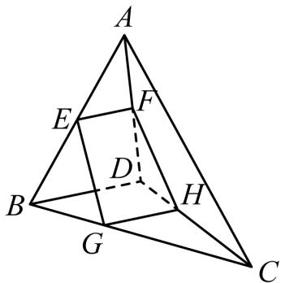

<!-- question-source:start -->
8.【问答题】如图，空间四边形ABCD中，平面EFHG分别交边AB，AD，CD，CB于E，F，H，G四点，其中E，F分别是AB，AD的中点，点G，H满足BG：GC=DH：HC=1：2。试判断直线AC与平面EFHG的位置关系，并说明理由。

<!-- question-source:end -->

![[高中/课堂同步/智慧中小学/必修第二册/第八章 立体几何初步/8.4.2 空间点、直线、平面之间的位置关系/8_4_2空间点_直线_平面之间的位置关系/三_复合题/习题/answers/Q00052377A1.md]]
