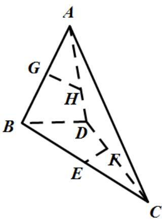

<!-- question-source:start -->
9. 【问答题】如图，在三棱锥A-BCD中，E,G分别是BC,AB的中点，点F在CD上，点H在AD上，且有DF:FC=DH:HA=2:3. 试判定直线EF,GH,BD的位置关系.

<!-- question-source:end -->

![[高中/课堂同步/智慧中小学/必修第二册/第八章 立体几何初步/8.4.2 空间点、直线、平面之间的位置关系/8_4_2空间点_直线_平面之间的位置关系/三_复合题/习题/answers/Q00052378A1.md]]
