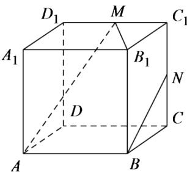

<!-- question-source:start -->
2.【填空题】如图，在正方体 $ABCD-A_{1}B_{1}C_{1}D_{1}$ 中，M,N分别为棱 $C_{1},D_{1},C_{1},C$ 的中点，有以下四个结论：

①直线AM与 $C_{C_{1}}$ 是相交直线；

②直线AM与BN是相交直线；

③直线BN与 $MB_{1}$ 是异面直线；

④直线AM与 $D_{D_{1}}$ 是异面直线。

其中正确的结论为\_\_\_\_。

<!-- question-source:end -->

![[高中/课堂同步/智慧中小学/必修第二册/第八章 立体几何初步/8.4.2 空间点、直线、平面之间的位置关系/8_4_2空间点_直线_平面之间的位置关系/二_填空题/习题/answers/Q00052371A1.md]]
