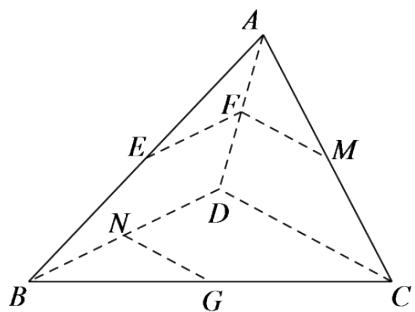

<!-- question-source:start -->
2.【填空题】如图，在三棱锥ABCD中，E,F,M,N分别为AB,AD,AC,BD的中点，G为棱BC上一点，且满足 $BC=\lambda BG$ ，若 $\angle EFM=\angle BNG$ ，则实数 $\lambda$ 的值为\_\_\_\_。

<!-- question-source:end -->

![[高中/课堂同步/智慧中小学/必修第二册/第八章 立体几何初步/8.5 空间直线、平面的平行/8_5空间直线_平面的平行习题课_1_/二_填空题/习题/answers/Q00052367A1.md]]
