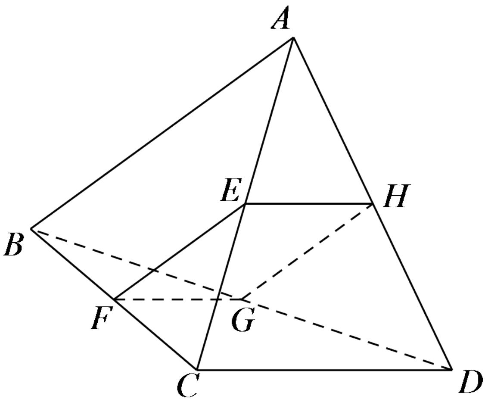

<!-- question-source:start -->
4.【问答题】如图所示，在空间四边形ABCD中，AC,BD为其对角线，E,F,G,H分别为AC,BC,BD,AD上的点，若四边形EFGH为平行四边形，求证：AB//平面EFGH。

<!-- question-source:end -->

![[高中/课堂同步/智慧中小学/必修第二册/第八章 立体几何初步/8.5 空间直线、平面的平行/8_5空间直线_平面的平行习题课_1_/四_问答题/习题/answers/Q00052369A1.md]]
