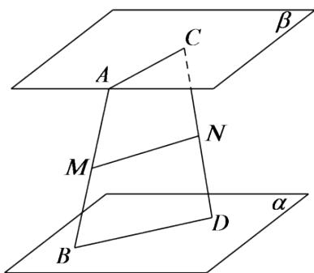

<!-- question-source:start -->
3.【问答题】如图，已知 $AB, CD$ 是夹在两个平行平面 $\alpha, \beta$ 之间不共面的两条线段， $M, N$ 分别为 $AB, CD$ 的中点，求证： $MN // \alpha$ 。

<!-- question-source:end -->

![[高中/课堂同步/智慧中小学/必修第二册/第八章 立体几何初步/8.5 空间直线、平面的平行/8_5空间直线_平面的平行习题课_2_/三_问答题/习题/answers/Q00052365A1.md]]
