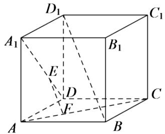

<!-- question-source:start -->
2.【填空题】如图，在正方体 $ABCD-A_{1}B_{1}C_{1}D_{1}$ 中，点E,F分别在AD,AC上，且 $A_{1}E=2ED$ ，CF=2FA，则EF与 $BD_{1}$ 的位置关系是\_\_\_\_。

<!-- question-source:end -->

![[高中/课堂同步/智慧中小学/必修第二册/第八章 立体几何初步/8.5 空间直线、平面的平行/8_5空间直线_平面的平行习题课_2_/二_填空题/习题/answers/Q00052364A1.md]]
