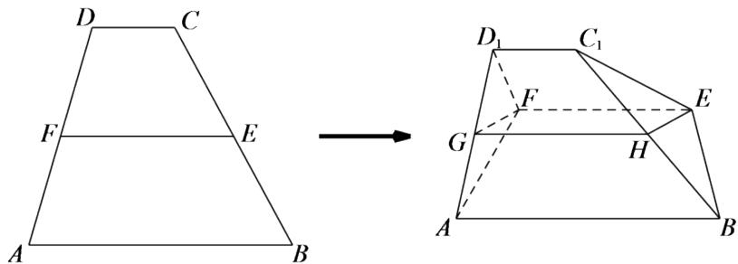

<!-- question-source:start -->
3.【问答题】在梯形ABCD中， $AB // CD$ ，E,F分别为BC,AD的中点，将平面DCEF沿EF翻折起来，使CD到 $C_{1}D_{1}$ 的位置，G,H分别为 $AD_{1},BC_{1}$ 的中点，求证：四边形EFGH平行四边形。

<!-- question-source:end -->

![[高中/课堂同步/智慧中小学/必修第二册/第八章 立体几何初步/8.5.1 直线与直线平行/8_5_1直线与直线平行/三_问答题/习题/answers/Q00052389A1.md]]
