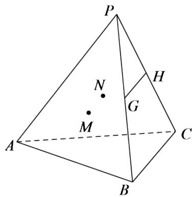

<!-- question-source:start -->
4.【问答题】如图，在三棱锥P-ABC中，G,H分别是PB,PC的中点，M,N分别是 $\triangle PAB$ ， $\triangle PAC$ 的重心．求证：GH//MN。

<!-- question-source:end -->

![[高中/课堂同步/智慧中小学/必修第二册/第八章 立体几何初步/8.5.1 直线与直线平行/8_5_1直线与直线平行/三_问答题/习题/answers/Q00052390A1.md]]
