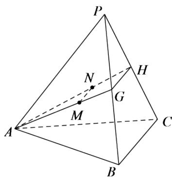

> [!faq]- 《8.5.1直线与直线平行》答案与解析
>
> > [!success]- **【答案】** 证明：如图，  连接AG,AH，因为M,N分别是 $\triangle PAB,\triangle PAC$ 的重心，所以M,N分别在AG,AH上，且 $\frac{AM}{AG}=\frac{AN}{AH}=\frac{2}{3}$ ，由平面几何知识知,GH//MN。
>
> > [!note]- **【解析】**
> > 【更多习题信息】
> >
> > 难易度：简单
> >
> > 知识点：直线与直线的位置关系
> >
> > 【智慧中小学APP扫码查看完整解析】
> >
> > 
