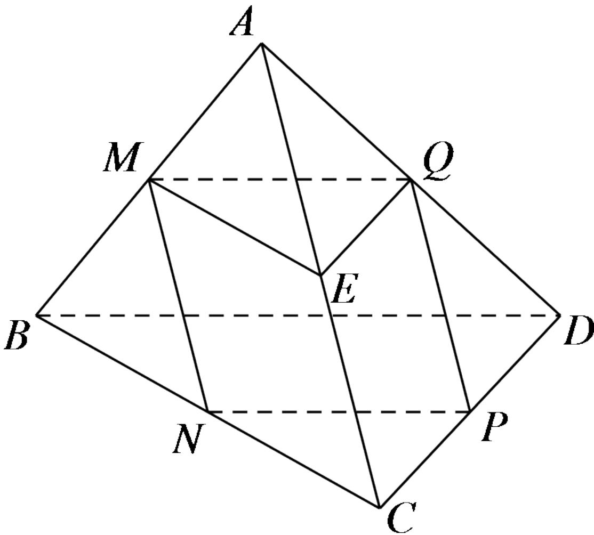

<!-- question-source:start -->
2.【多选题】（多选）如图，在四面体ABCD中，M,N,P,Q,E分别是AB,BC,CD,AD,AC的中点，则下列说法中正确的是（）

A. $M, N, P, Q$ 四点共面

B. $\angle QME = \angle DBC$

C. $\triangle BCD \sim \triangle MEQ$

D. 四边形MNPQ为菱形
<!-- question-source:end -->

![[高中/课堂同步/智慧中小学/必修第二册/第八章 立体几何初步/8.5.1 直线与直线平行/8_5_1直线与直线平行/二_多选题/习题/answers/Q00052388A1.md]]
