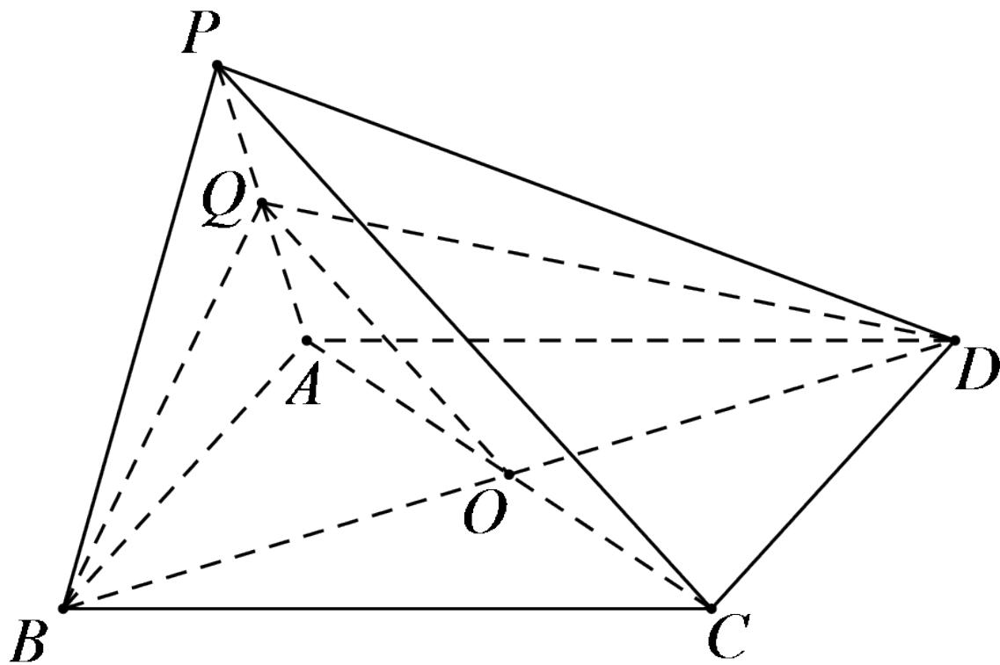

<!-- question-source:start -->
1. 【单选题】如图，P为平行四边形ABCD所在平面外一点，Q为PA的中点，O为AC与BD的交点，下列说法中错误的是（）

A. $OQ \parallel$ 平面PCD

B. PC // 平面BDQ

C. AQ // 平面PCD

D. CD // 平面PAB
<!-- question-source:end -->

![[高中/课堂同步/智慧中小学/必修第二册/第八章 立体几何初步/8.5.2 直线与平面平行/8_5_2直线与平面平行_1_/一_单选题/习题/answers/Q00052383A1.md]]
