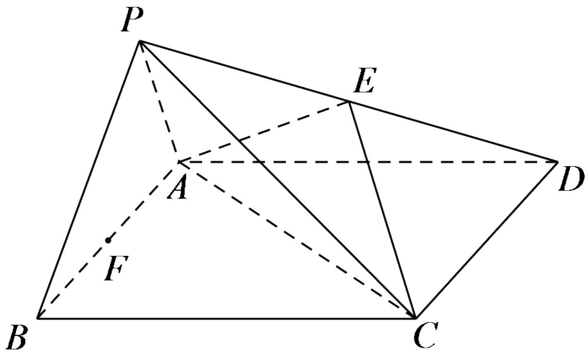

<!-- question-source:start -->
4.【复合题】如图，四棱锥P-ABCD中，底面ABCD为平行四边形，F是AB的中点，E是PD的中点。

(1)【问答题】
<!-- question-source:end -->

![[高中/课堂同步/智慧中小学/必修第二册/第八章 立体几何初步/8.5.2 直线与平面平行/8_5_2直线与平面平行_1_/三_复合题/习题/answers/Q00052386A1.md]]
